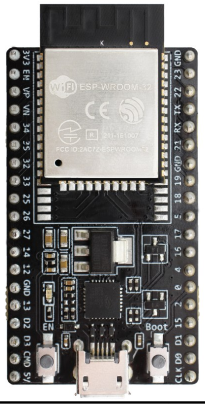
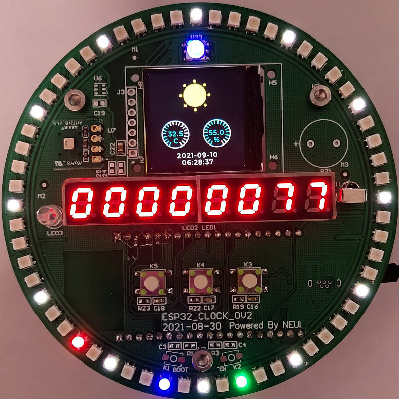

# Skids2

随着国产芯的崛起和物联网技术迅速发展，一款集性能与性价比于一身的物联网芯片被广泛应用。ESP32，这是乐鑫信息科技(以下简称乐鑫)推出的一块WIFI芯片。

ESP32 集成了天线开关、射频 balun、功率放大器、低噪放大器、过滤器和电源管理模块，整个解决方案占用了最少的印刷电路板面积。2.4 GHz Wi-Fi 加蓝牙双模芯片采用 TSMC 低功耗 40nm 技术，功耗性能和射频性能最佳，安全可靠，易于扩展至各种应用。

## SKIDS系列教学产品

鉴于ESP32广受开发者和企业的青睐，我们围绕此芯片或模组设计了多款教学产品：Skids、EDU_Skids、Skids2。

Skids：主打趣学，主要基于Blockly开发，完成一些掌机小游戏，让学习变得更有乐趣。

EDU_Skids：是EDU套件的一个模块，可用作网关，亦可做扩展开发。主要用于创新应用的学习和开发。

Skids2：主打物联网，时钟表盘的造型，不仅是学习的平台，完成设计后还能是一个非常不错的摆件，在学习中体会到满满的成就感。

## ESP32 资源

* 集成2.4G Wi-Fi 和 蓝牙
* 520KB RAM
* 支持扩展SRAM和ROM（常见2MB、4MB、8MB）
* 外设接口:
* 34个GPIOs
* 18通道 12位ADC
* 2x8 bit DAC
* 10路触摸输入
* 4路SPI
* 2路I2S
* 2路I2C
* 3路UART
* 1路SDIO（主）
* 1路SDIO/SPI（从）
* 支持网络接口
* 支持电机驱动
* 支持红外收发
* 支持电机PWM控制
* 支持16路PWM输出控制LED

## Skids2 外设

* RGB x 1
* 按键：用户按键 x 4，下载按键 x 2
* RGB：WS2812 最大60颗
* 温湿度传感器：AHT21
* 红外收发：38KHz
* 数码管：4位 x 2，驱动芯片AIP1638
* LCD：1.3寸模块或焊接式1.3寸屏
* 支持两种处理器模式：最小系统和芯片模组

## Skids2 典型应用

* RGB颜色控制，搭配物联网云平台可完成智能灯试验
* 数码管，共计8位数码管，可做计数，可做日历，通过网络SNTP服务可实现网络时钟试验
* 红外收发，可用于遥控加电设备或通遥控器控制板上设备，可完成物联网网关试验
* LCD屏，基于LVGL开发，可用于学习HMI设计，如实现天气时钟应用
* 其他：设备联网、接入阿里云平台、接入天猫精灵等物联网试验。

## Skids2 教学资源

* 围绕Skids2，我们设计了大量的微课供大家学习，微课内容涵盖了硬件、软件、GUI和物联网应用。
* 原理图设计+PCB设计
* 基于FreeRTOS的应用软件开发
* 基于LVGL的GUI界面开发
* 物联网应用

## 效果图

